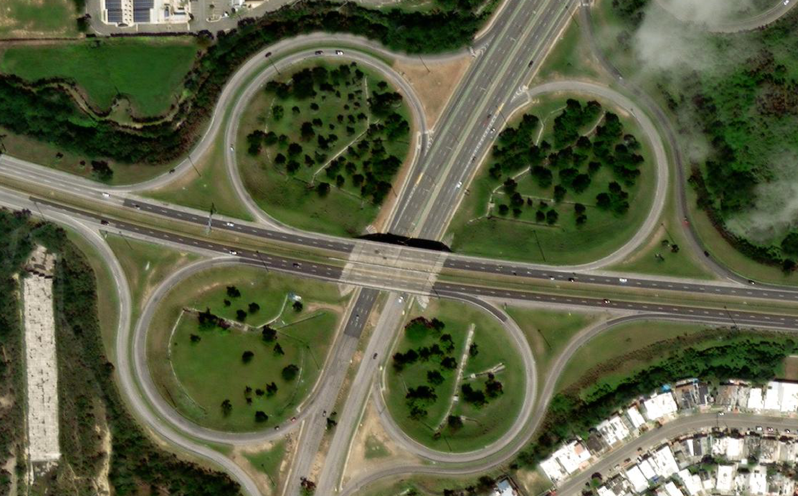
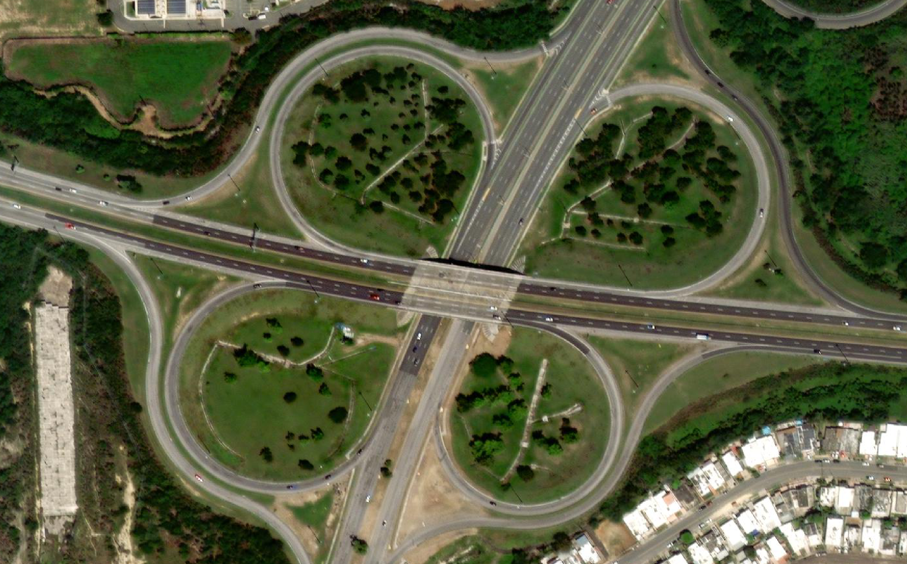
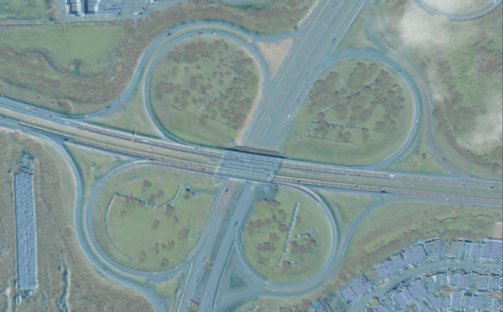

# Coregister


<p align="left">
  
  
  <figcaption> Reference Image (left), Target Image (right) </figcaption>
</p>
<p align="left">
  
  
  <figcaption> Target Image (left) and Coregistered Image (right) overlaid on top of the Reference Image.</figcaption>
</p>
<p align="left">
  
  
  <figcaption> Before (left, red), After (right, blue) overlaid on top of the Reference Image.</figcaption>
</p>

-----

This is very much a nascent capability that doesn't work well under all circumstances. It struggles with large open/homogeneous landscapes, e.g., open ocean or other large water bodies, agricultural, and desert or snow covered landscapes. It also struggles with very large satellite image scenes where keypoints may not get distributed evenly, causing the coregisterd image to warp upon itself and look like an abstract ink blot. 

Generally, it works better on smaller images (subsets of larger scenes) or lower resolution images (e.g., PlanetScope) where keypoint matches are better or constrained. Supplying an Area of Interest file to constrain the keypoints to also helps generate better results and ensures distinct features will be included in the keypoint matching. 

The current method relies on ORB (Oriented FAST and Rotated BRIEF) from OpenCV. Next, I'll be working to implement it using SIFT (Scale-Invariant Feature Transform) as well as explore some deep learning methods. I'll also be looking at potential ways to mitigate the large scene issue through, for example, a sliding window and extracting/comparing keypoints of windows of images before collating Ground Control Points (GCPs) at the end. 

Generally, this capability works by extracting keypoints and descriptors from both the reference image and the target image. The keypoints from each image are then compared to one another to identify matching pairs of keypoints. The pixel coordinates of the matching keypoints are then converted to Longitude, Latitude coordinate pairs using an Affine transformation. GDAL Translate is then used to rereference the target image using the matching keypoints as GCPs. For a smaller image such as the one above (4169 width, 2163 height), the end to end process is approximately 0.5 seconds. 

Task List
- [ ] Update README with installation, usage, etc.
- [x] Write unit tests
- [x] ~~Implement SIFT~~ _(implemented SIFT but very memory intensive for large images, necessitates implementing something like keypoint matching on sliding windows)_
- [ ] Better AOI constraints
- [ ] Sliding window keypoint comparison
- [ ] Implement deep learning methods
- [ ]

## Installation:

clone the repository, `pip install .`

## Usage (TBD):

Package import usage:
```python
from package.main import test_function
test_function()

```

CLI usage:
```
usage: package [-h] --arg ARG

optional arguments:
  -h, --help            show this help message and exit
```

Example: `package --arg`
